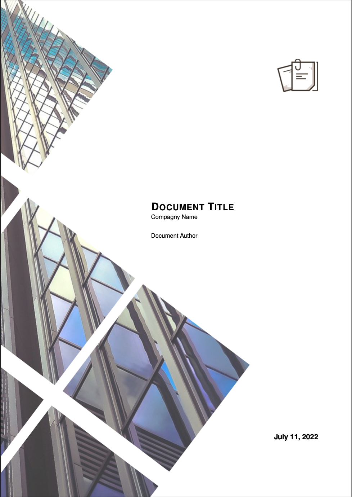
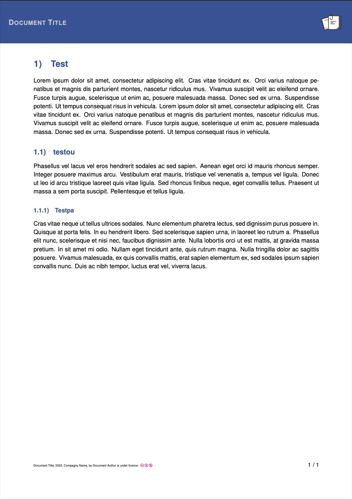

# LaTeX-modern-document
LaTeX-modern-document is a LaTeX template to create professional looking reports quickly and effortlessly.

# preview

| cover page | sample page |
| :------------------: | :------------------: |
|  |  |

# Dependencies
* A functional LaTeX environment (TeXLive for example).

# Quick start
To use this document you first have to customize it to your liking via the `config.tex` file, then compile it:

## In command line
* you can compile your document with the command `pdflatex [name].tex`.

## With a software
* VS code ;
* TeXMaker
* Lyx
* ...

## With OverLeaf
* Create an account (if you don't have one)
* Open a new project
* Import **all** (except the *readme*, *.gitignore* and *examples* folder) files from this repo to overleaf
* *Enjoy!*

# Customizable elements and features of the template

## Personalization

From the `config.tex` file you can customize : 
* The main color of the document
* The color of the text on the header
* The elements of the front page (author, title, date, logo, page background, ...)
* The header image of the pages

## Features

* Customizable cover page
* Clean style (colored header, modern typography)
* Three levels of numbering (I, 1, a)
* Automatic page numbering
* Stylized display of the code (highlighting of key words)
* Use of "TextBox" (see the documentation of https://mirrors.ircam.fr/pub/CTAN/graphics/awesomebox/awesomebox.pdf)

# Licence

This project is under the MIT free license, more info on the license here :
https://github.com/thomasbenas/LaTeX-modern-document/blob/master/LICENSE

# Comments and ideas

For any questions / remarks about this template you can contact me via the following email address: thomas@benas.fr.
